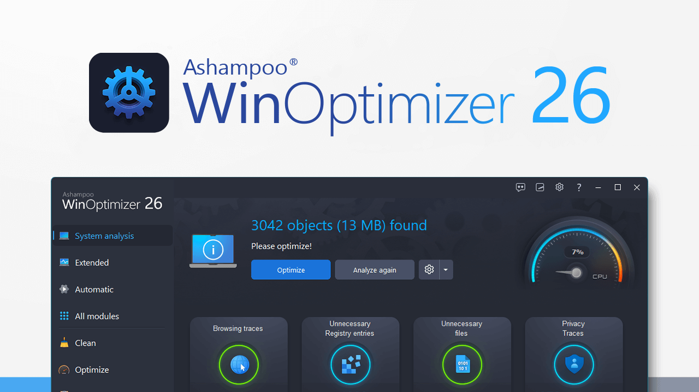

## winoptimizer crack download | winoptimizer cracked version

Over time, PCs can become sluggish due to accumulated junk files, registry errors, privacy-invading background processes, and inefficient resource use. **Ashampoo WinOptimizer** is a powerful system optimization tool designed to enhance the performance, privacy, and stability of Windows PCs. It offers a comprehensive suite of features suitable for both novice and advanced users.

### Key Features of Ashampoo WinOptimizer

| **Feature**                | **Description**                                                                                      |
| -------------------------- | ---------------------------------------------------------------------------------------------------- |
| **One-Click Optimization** | Quickly scans and optimizes your system with a single click.                                         |
| **Privacy Protection**     | Includes AntiSpy and Win10 Privacy Control to disable telemetry and other privacy-invasive features. |
| **Drive Cleaner**          | Removes unnecessary files to free up disk space.                                                     |
| **Registry Optimizer**     | Fixes registry errors to improve system stability.                                                   |
| **Startup Tuner**          | Manages startup items to speed up boot time.                                                         |

---

### Ashampoo WinOptimizer vs. Other Optimization Tools

| **Aspect**              | **Ashampoo WinOptimizer**                                  | **IObit Advanced SystemCare**                     | **CCleaner**                                                 |
| ----------------------- | ---------------------------------------------------------- | ------------------------------------------------- | ------------------------------------------------------------ |
| **Ease of Use**         | User-friendly interface suitable for all levels            | Intuitive interface with basic features           | Simple interface with essential cleaning tools               |
| **Privacy Features**    | Comprehensive privacy controls                             | Basic privacy tools                               | Limited privacy features                                     |
| **System Optimization** | Extensive optimization tools and modules                   | Focused on performance and security               | Primarily cleans junk files                                  |

---

### Step-by-Step Workflow for Installing Ashampoo WinOptimizer

| **Step**                      | **Action**                                                                                                     |
| ----------------------------- | -------------------------------------------------------------------------------------------------------------- |
| **1. Download Tool**          | Obtain Ashampoo WinOptimizer from the [official website](https://github.com/LennoxSellers04/ashampoo-winoptimizer-download-link/).|
| **2. Install Software**       | Run the installer and follow the on-screen instructions.                                                       |
| **3. Activate License**       | Enter your license key during installation or after launching the program.                                     |
| **4. Configure Settings**     | Adjust settings according to your preferences and system requirements.                                         |
| **5. Run Optimization**       | Use the One-Click Optimization feature to start the optimization process.                                      |

---

### Use Cases for Ashampoo WinOptimizer

| **Scenario**                | **Description**                                                    | **Example**                                               |
| --------------------------- | ------------------------------------------------------------------ | --------------------------------------------------------- |
| **Home Users**              | Improve system performance and privacy with minimal effort         | Regularly clean up junk files and manage startup items.   |
| **Gamers**                  | Optimize system resources for a better gaming experience           | Use Game Booster to allocate more resources to games.     |
| **Privacy-Conscious Users** | Enhance privacy by disabling telemetry and other tracking features | Utilize AntiSpy and Win10 Privacy Control modules.        |
| **IT Professionals**        | Manage multiple systems and perform advanced optimizations         | Deploy Profile Booster and Crash Analyzer across devices. |

### Conclusion

**Ashampoo WinOptimizer** stands out as a comprehensive and user-friendly system optimization tool. Its extensive features cater to a wide range of users, from beginners seeking simple maintenance to professionals requiring advanced tools. With its one-time purchase model and multi-device support, it offers excellent value for those looking to enhance their Windows PC experience.
